1. Просмотрите историю коммитов в своём проекте и выберите три случайных коммита. Просмотрите изменения, которые были в них сделаны.

>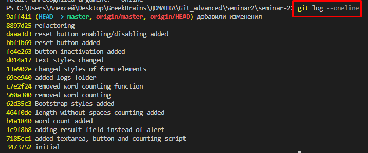
>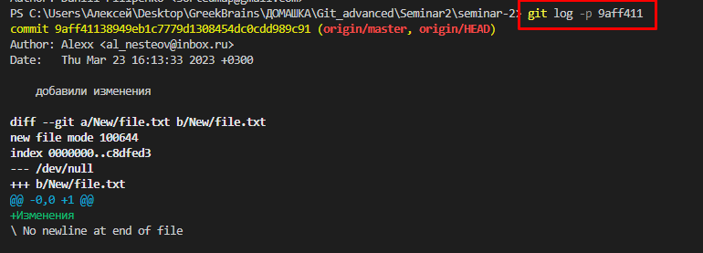
>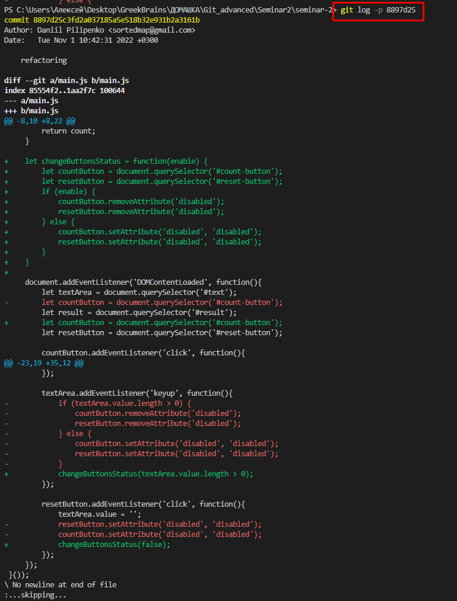
>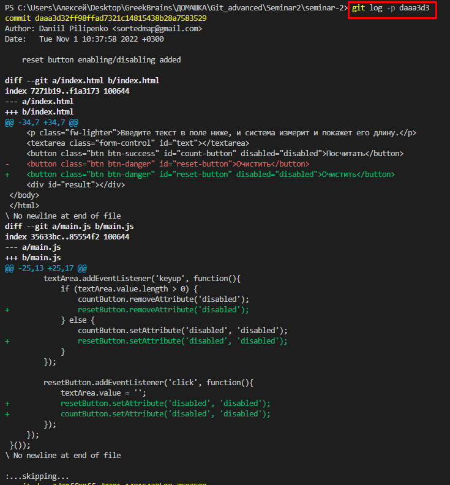

 
 
2. Верните эти изменения командой git revert последовательно, чтобы в итоге получилось тоже три коммита.
 
 

>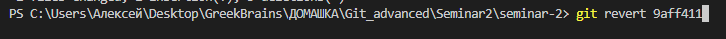
>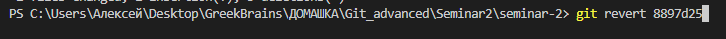
>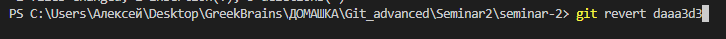
> git log --oneline - (отобразятся эти 3 комита) - скрин забыл прикрепить

 
 
3. Попробуйте отменить эти три коммита:  

* последний — командами git reset --soft и git restore;
 
 

>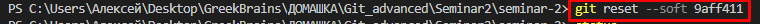
>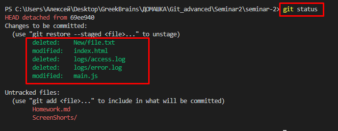
>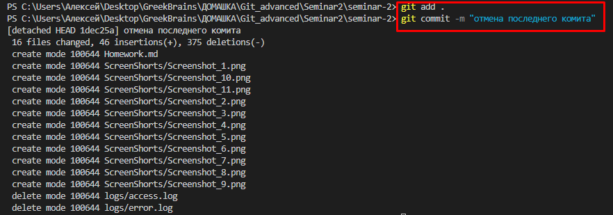
>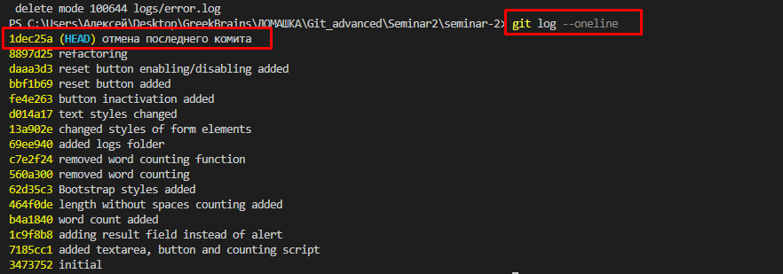

 

* предпоследний — командой git reset --mixed и git restore;
 
 

>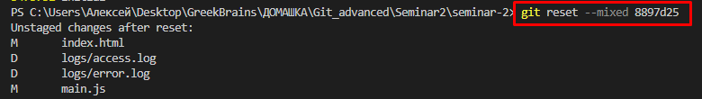
>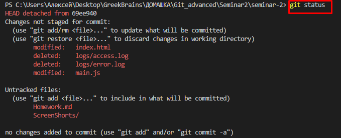
>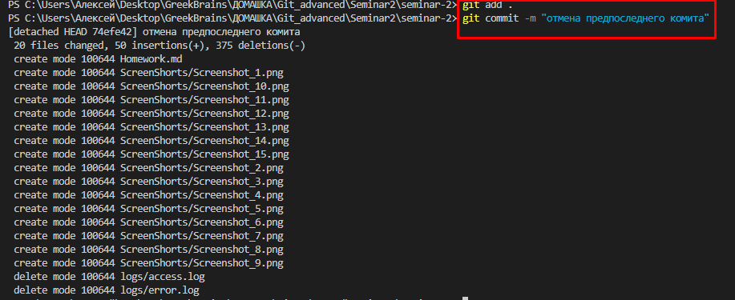
>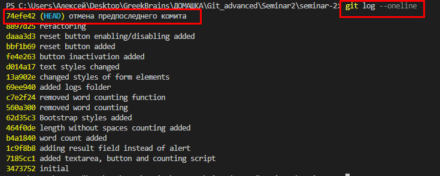

* первый — командой git reset --hard.
 
 

>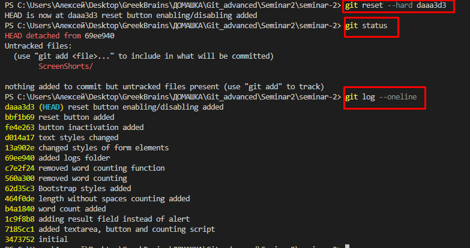

